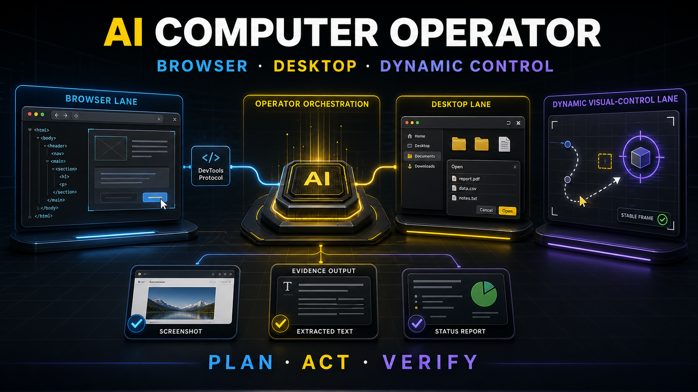

# AI Computer Operator



**AI Computer Operator** is a public, general-purpose skill for turning approved computer tasks into safe, visible, and verifiable automation across browser, desktop, and dynamic visual UI surfaces.

The core rule is simple:

> Plan first. Act only inside the approved scope. Verify with visible evidence.

## Three-Lane Control Model

AI Computer Operator uses a three-lane model. It routes each task to the narrowest control lane that can complete the work and prove the result.

| Lane | Best for | How it runs |
| --- | --- | --- |
| Browser lane | Web pages, forms, screenshots, DOM checks, local web app QA | `browser-harness` with Chrome DevTools Protocol, host browser tools when already active, or the packaged Docker browser runtime |
| Desktop lane | Native apps, file pickers, OS dialogs, local file workflows, non-browser windows | A trusted host desktop provider, validated through `ACO_DESKTOP_PROVIDER_CHECK` |
| Dynamic visual lane | Moving targets, drag validation, canvas, animation, timing-sensitive UI, non-static visual state | `observeStable` for browser pages, plus a trusted host dynamic provider for targets outside the browser container |

The browser lane recommends [browser-harness](https://github.com/browser-use/browser-harness) for browser automation. Thanks to the browser-harness project for the open-source foundation. In this runtime, browser-harness connects to a Chrome DevTools Protocol endpoint, performs scoped page actions, and returns screenshots, text snapshots, final URLs, and state evidence.

The desktop and dynamic lanes are what make the skill useful beyond ordinary webpage checks. They let an agent reason about native UI, visual state changes, motion, drag-and-drop outcomes, and tasks that require more than static DOM access. Because native desktop control depends on each user's operating system, permissions, and agent platform, this repo exposes provider health checks instead of bundling one fixed provider for every machine.

## Desktop And Dynamic Control

The desktop lane handles native surfaces: file pickers, save dialogs, desktop apps, local file workflows, browser extension prompts, and multi-window tasks. It works through a trusted host desktop provider that can observe visible state, send mouse/keyboard input, and return evidence such as screenshots, window state, or changed file paths.

The dynamic visual lane handles moving or pixel-based targets: drag-and-drop, canvas, WebGL, animated charts, maps, streamed apps, game-like UI, and timing-sensitive visual states. Browser pages can use the included `observeStable` action; non-browser targets need a host dynamic provider that can run a short observe-act-observe feedback loop.

The repository includes the browser runtime, Chrome DevTools Protocol support, browser-harness integration, `observeStable`, Docker, tests, and doctor checks. Desktop and host-level dynamic work is plugged in through the user's host agent, such as a desktop/computer-use connector or dynamic-control connector with screen, input, and permission access.

Required host providers are checked through:

```bash
export ACO_DESKTOP_PROVIDER_CHECK="your-desktop-provider --health"
export ACO_DYNAMIC_PROVIDER_CHECK="your-dynamic-provider --health"
npm run doctor
```

See `references/desktop-dynamic-control.md` for the full provider contract, dependency model, routing examples, complex scenarios, and safety boundaries.

## What It Helps With

| Use case | What the skill does |
| --- | --- |
| Browser workflows | Open pages, inspect visible content, fill approved fields, click approved controls, capture evidence. |
| Desktop workflows | Coordinate host-provider work for native windows, file pickers, local apps, and file operations. |
| Dynamic UI checks | Watch browser-page motion with `observeStable` or route moving native targets to a host dynamic provider. |
| QA routines | Run repeatable checks for landing pages, docs, dashboards, and local web apps. |
| Evidence bundles | Return screenshots, extracted text, final URLs, file paths, reports, and unresolved risks. |

## Safety Model

This skill is intentionally conservative.

- No hidden browsing or background account actions.
- No irreversible action without explicit user approval.
- No financial actions, trading, withdrawals, purchases, or account changes by default.
- No secret handling unless the user explicitly provides a safe runtime and confirms the scope.
- No local/private network access in the Docker runtime unless enabled with `--allow-local`.
- Every meaningful run should end with a visible verification artifact.

## Repository Contents

```text
.
├── SKILL.md                    # Public skill instructions for AI agents
├── agents/openai.yaml          # Agent display metadata
├── references/                 # Safety model, recipes, prompt pack
├── src/                        # Portable browser runtime and plan runner
├── tests/                      # Safety and schema tests
├── examples/                   # Example browser automation plans
├── assets/                     # README visuals
├── Dockerfile                  # Containerized browser runtime
└── docker-compose.yml          # Local run helper
```

## Quick Start: Prompt Install

Paste this into an AI agent that can access GitHub and write local files:

```text
Install AI Computer Operator from this public repository:
https://github.com/miyahluvgames-source/ai-computer-operator

If you can persist skills in this environment:
1. Clone or download the repository.
2. Install it as a skill named ai-computer-operator in the appropriate skill directory for this agent.
3. Include SKILL.md and the references folder. Do not copy .git, node_modules, artifacts, generated images, caches, or temporary outputs.
4. From the repository root, run npm run doctor.
5. If dependencies are missing, show me the available repair options first: npm run setup:local, npm run setup:browser-harness, npm run setup:browsers, or Docker.

If you cannot persist skills:
1. Load SKILL.md and the relevant references for this chat only.
2. Tell me clearly that this is a session-only setup.

Do not perform destructive, account-changing, financial, or secret-handling actions during installation.

Return:
- install mode: persistent or session-only
- installed path, if available
- doctor status
- missing providers or dependencies
- one safe test command or test task I can run next
```

A prompt can only install the skill when the target agent has repository access and permission to write to its skill directory. If the agent cannot persist custom skills, the same prompt still lets it load the instructions for the current session.

After installation, ask:

```text
Use AI Computer Operator to open this page, confirm the main headline, take a screenshot, and tell me what changed.
```

The agent should:

1. Restate the task boundary.
2. Pick the right lane: browser, desktop, or dynamic visual control.
3. Identify risky steps before acting.
4. Execute only the approved steps.
5. Return evidence: screenshot path, final URL, visible text, file path, or a short report.

## Quick Start: Docker Runtime

Docker provides the portable runtime for the browser lane and browser-page dynamic checks. It packages:

- the public `SKILL.md` and references
- Node.js runtime
- Chromium browser
- browser-harness
- Chrome DevTools Protocol exposure
- browser-page dynamic observation with `observeStable`
- a deterministic JSON plan runner
- examples and tests

Use Docker when a user's machine is missing browser automation dependencies or when you want an isolated reference runtime. Native desktop windows and host-level dynamic control still require host providers because a browser container normally cannot control the user's real desktop.

Build:

```bash
docker build -t ai-computer-operator .
```

Run the example plan:

```bash
docker run --rm \
  -p 9222:9222 \
  -v "$PWD/artifacts:/app/artifacts" \
  ai-computer-operator \
  --engine browser-harness \
  --plan examples/example-plan.json \
  --cdp-port 9222 \
  --out artifacts
```

With Docker Compose:

```bash
docker compose run --rm --service-ports operator --engine browser-harness --plan examples/example-plan.json --cdp-port 9222 --out artifacts
```

The runtime writes:

- `session-report.json`
- screenshots
- extracted text files
- optional Playwright trace files

## Setup Doctor

If a user's local machine is missing dependencies, run:

```bash
npm run doctor
```

The doctor checks Node.js, npm, package dependencies, Chromium, browser-harness, the browser dynamic runtime, Docker, and optional host providers. It does not install anything by itself; it prints repair options the user can choose.

Common repair paths:

```bash
npm run setup:local             # install Node deps, Chromium, and browser-harness
npm run setup:browser-harness   # only install or refresh browser-harness
npm run setup:browsers          # only install Playwright Chromium
```

Host providers can be checked without hardcoding a provider:

```bash
export ACO_DESKTOP_PROVIDER_CHECK="your-desktop-provider --health"
export ACO_DYNAMIC_PROVIDER_CHECK="your-dynamic-provider --health"
npm run doctor
```

Use PowerShell syntax on Windows:

```powershell
$env:ACO_DESKTOP_PROVIDER_CHECK="your-desktop-provider --health"
$env:ACO_DYNAMIC_PROVIDER_CHECK="your-dynamic-provider --health"
npm run doctor
```

If local browser setup is blocked, use Docker as the reference environment:

```bash
docker build -t ai-computer-operator .
docker run --rm -v "$PWD/artifacts:/app/artifacts" ai-computer-operator --engine browser-harness --plan examples/example-plan.json --out artifacts
```

See `references/provider-setup.md` for provider setup and `references/desktop-dynamic-control.md` for desktop and dynamic control details.

## Runtime Engines

The runtime supports three browser-engine modes:

- `auto`: use browser-harness when installed, otherwise use the Playwright fallback.
- `browser-harness`: run through browser-harness and CDP. The runtime can launch its own Chromium CDP endpoint or connect to one with `--cdp-endpoint`.
- `playwright`: use the deterministic Playwright runner directly.

`auto` never retries with another engine after an execution has already started. This avoids duplicated clicks, form fills, or other side effects.

## Example Plan

```json
{
  "name": "Example Domain check",
  "startUrl": "https://example.com",
  "steps": [
    { "action": "goto", "url": "https://example.com" },
    { "action": "assertText", "selector": "body", "contains": "Example Domain" },
    { "action": "screenshot", "name": "example-home.png", "fullPage": true },
    { "action": "extractText", "selector": "body", "name": "example-home-text.txt" }
  ]
}
```

For dynamic browser pages, use `observeStable` or run:

```bash
npm run run:example:dynamic
```

## Runtime Actions

Supported browser-plan actions:

- `goto`
- `click`
- `fill`
- `press`
- `waitFor`
- `wait`
- `screenshot`
- `extractText`
- `assertText`
- `selectOption`
- `check`
- `uncheck`
- `hover`
- `setViewport`
- `observeStable`

Risky selectors or labels such as delete, withdraw, transfer, buy, sell, purchase, payment, and submit are blocked unless the runtime is explicitly started with a risky-action override.

## Why Playwright Appears In The Runtime

The preferred browser path is browser-harness with Chrome DevTools Protocol. Playwright remains in the package to provide Chromium in Docker, expose a CDP endpoint, and run a deterministic fallback when browser-harness is unavailable.

## Local Development

```bash
npm install
npm run install:browsers
npm run verify
npm run run:example:browser-harness
```

If browser dependencies are missing or hard to install locally, use the Docker path instead.

## Version Freshness

This project includes a version gate:

```bash
npm run check:latest
```

It verifies that:

- `playwright` in `package.json` matches npm registry latest
- `package-lock.json` matches the same Playwright version
- the Docker base image uses the same Playwright version
- the Docker npm version and `packageManager` match npm registry latest
- the Docker and package metadata pin the latest PyPI `browser-harness` release

CI runs the same gate before linting and tests, so dependency drift is caught early.

## License

MIT
